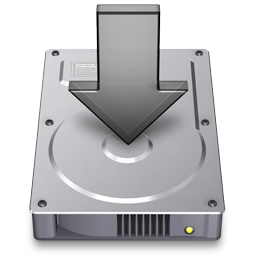
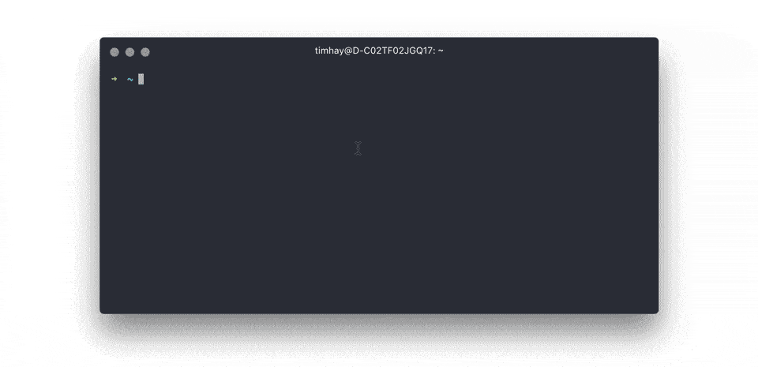

<!-- Links -->
[Platypus]: https://sveinbjorn.org/platytpus
[Platypus Docs]: https://sveinbjorn.org/files/manpages/PlatypusDocumentation.html
[Back To Top ↑]: #overview

<div align="center">



# Deploy Templates CLI

Command line tool to deploy the SBS Motion Graphics Templates

**[Overview](#overview) | [Updating the Files](#updating-the-files) | [Using the CLI](#using-the-cli) | [How It Works](#how-it-works)**

</div>

## Overview

The deploy templates CLI automates the process of deploying any changes made to the SBS templates, across the various files and installers used across the business.

This consists of:

1. Creating new installer apps with the new bundled templates and changelogs
2. Copying the installers into the appropriate directories on the server
3. Syncing the template files with the neccesary server locations

These steps are done based on the files in the folder structure, as well as user input to the command line prompts.

[Back To Top ↑]

## Contents

- [Dependancies](#dependancies)
- [Updating the files](#updating-the-files)
  - [Templates](#updating-the-templates)
  - [Changelogs](#updating-the-changelogs)
- [Using the CLI](#using-the-cli)
- [How it Works](#how-it-works)
  - [The Installer Apps](#the-installer-apps)
  - [The Installer Script](#the-installer-script)
  - [The Deploy Templates CLI](#the-deploy-templates-cli)

[Back To Top ↑]

## Dependancies

To create the installers, the [Platypus] command line interface must be installed. For more info on installing [Platypus] and it's CLI, see the [How it works](#installing-the-platypus-cli) section.

[Back To Top ↑]

## Updating the files

<details><summary>Project File Structure</summary>
<p>

The CLI works on assumptions about the file structure of project, and so any changes made to the files must be done within this specific structure.

```files
base-folder
├── deploy-templates.sh
├── dist
│   └── installerName.app
├── LICENSE
├── README.md
├── src
│   ├── template-package-name
│   │   ├── changelog
|   |   |   ├── index.html
|   |   |   └── main.css
│   │   ├── icon.icns
│   │   ├── installer.config
│   │   ├── templates
│   │   |   └── mogrt-files
```

The files that are distrubuted are located in the `src/` folder, with a sub folder for each package, e.g. `src/news` and `src/social`. All the templates and installer properties are contained within each of these package folders.

</p>
</details>

<details><summary>Versioning System</summary>
<p>

The installers, changelog and templates are versioned according to the [Semantic Versioning System](https://semver.org/).

</p>
</details>

<details><summary>Creating New Packages</summary>
<p>

### Creating new packages

The CLI is currently configured to deploy two template packages, **SBS News** and **SBS Social**. A new package may be added by duplicating an existing package, renaming it, and modifying the following files:

- `package-name/changelog/index.html`

    The changelog should be changed to reflect the version history of the new package.

- `package-name/icon.icns`

    The icon file for the installer.

- `package-name/installer.config`

    This contains the package specific configuration for it's installer, and the `folderName` variable in this file should be updated to reflect the folder name of the installed templates, e.g. `SBS Radio`.

- `package-name/templates/`

    The template files for the new package should be placed into this folder.

</p>
</details>

### Updating the templates

The templates files for each package are located in `src/package-name/templates/`, with the directory strucure in this folder being copied over into the `Essential Graphics` folder of the end user.

- To add a new template to the package, it just needs to be added to this folder
- To update an existing template, the old one can be replaced with the updated `.mogrt` with an incremented version number.

During the installation to the end users `Essential Graphics` folder, old versions of the templates are deleted to match the source directory structure.

There is currently a sub folder for each aspect ratio provided, e.g. `src/social/templates/1x1/1x1_Bug_1.0.1.mogrt`.

### Updating the changelogs

The changelog site is bundled with each installer, and is located in the `src/package-name/changelog/` directory.

Any updates made to the template files should be documented in the `index.html` file for the respective package changelog.

> **👀 Possible Change**
> 
> The changelogs may soon be updated to source from a Markdown file hosted in this projects Github repository, rather than bundled with the installer. This file will be updated to reflect those changes if this is the case.

[Back To Top ↑]

## Using the CLI

> The following instructions are commands to be run in a mac terminal emulator, such as the macOS `Terminal.app`.



1. Change to the deploy templates folder, e.g. `'/Users/username/Desktop/mogrt-installer'`

    ```shell
    cd path/to/folder
    ```

2. Run the deploy templates script

    ```shell
    bash ./deploy-templates.sh
    ```

3. Follow the prompts to deploy the templates

[Back To Top ↑]

## How it Works

### The Installer Apps

The installers that the `deploy-templates.sh` script creates are macOS applications, that copy the template files into the relevant folders with a simple interface and error logging. An application called Platypus is used to create these installer apps.

**[Platypus]** is a simple app to create new macOS applications that run a script file with a selected interface and a couple of options. It can also create these application via the command line, using it's command line interface. The [Platypus] app and it's command line interface must be installed in order to run the deploy templates script.

#### Installing the Platypus CLI
1. Download and install the [Platypus] app
2. Install the CLI via the prefernces pane of the app:

    

[Back To Top ↑]

### The Installer Script

The installer script that the app runs is a [bash](https://en.wikipedia.org/wiki/Bash_(Unix_shell)) script that uses the `rsync` command to copy the templates out of the application bundle and into the correct Essential Graphics folders. It also creates the user prompts, error logging and install notifications.

The script can be found at `src/install-mogrt.bash` and is well documented with comments explaining what each step of the install process does.

#### Bash Scripting Resources:
- [Bash Scripting Cheatsheet](https://devhints.io/bash)
- [Awesome Bash Resource List](https://github.com/awesome-lists/awesome-bash)

[Back To Top ↑]

### The Deploy Templates CLI

The Deploy Templates CLI is another [bash script](#the-installer-script), `deploy-templates.sh`, that creates the [installer apps](#the-installer-apps) using the Platypus CLI. It also copies these installers into a couple of different locations, as well as syncs the individual template files into other locations for uses not running the installer apps.

It does this based on input given as answers to a list of specified questions, such as which packages to deploy, installer version numbers, and whether to sync the individual template files.

> **⚠️ Please Note**
> 
> At the moment, each package is hardcoded into the script in such a way that, if you were to [add a new    template package](#creating-new-packages) you would need to modify `deploy-templates.sh` with new prompts and variables. The plan is to create all of the prompts according to the package folders in `src/` so that packages can added and removed without modifying the script.

[Back To Top ↑]

## Contributing

Changes can be made by cloning this project locally, creating a new fork, and then creating a pull request to publish the changes to the master.

As this project is specific to the needs of deploying templates at SBS, many of the commands are dependant upon having various SBS specific drives and locations accesible.

> **⚠️ Please Note**
> 
> Due to their large files size, the templates and installer apps are not included as tracked files in this repo. This means to do any testing template files must be copied from elsewhere into the correct directories.

[Back To Top ↑]

----

<div align="center">
<p>

### 🎉 Happy templating! 🤙

Created by [Tim Haywood](https://timhaywood.com.au) and [Danny Jenkins](https://dannyjenkins.com.au) for [SBS Australia](https://sbs.com.au) 

Licensed under the terms of the [MIT License](LICENSE)

</p>
</div>

---